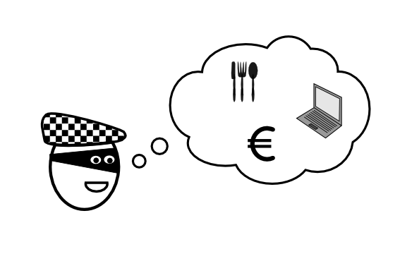

# Das Rucksack-Problem

Ein Einbrecher ist in eine Villa eingebrochen. Dort findet er so viele Wertgegenstände vor, dass er nicht alle in seinen Rucksack packen kann. Schreibe ein Programm, das eine optimale Auswahl trifft.

Der Einbrecher ist ein erfahrener Profi, der den Marktwert und die Größe jedes Gegenstandes in Null Komma Nichts genau einschätzen kann:

| Gegenstand | Größe | Wert |
|------------|-------|------|
| Laptop | 2  | 600,- |
| Silberbesteck | 2 | 400,- |
| Stereoanlage | 3  | 300,- |
| Juwelen | 2 | 1100,- |
| Vase | 5 | 700,- |
| Kamera | 2 | 500,- |
| Gemälde | 4 | 900,- |
| Bargeld | 1 | 800,- |

Der Rucksack hat ein Fassungsvermögen von `8`.

When Dein Programm es schafft, Gegenstände im Wert `3000` einzupacken, taugt es als App für Amateur-Einbrecher.

## Hinweise

* die optimale Lösung verwendet **dynamische Programmierung**
* verwende den unten angegebenen Pseudocode

### Pseudocode des Rucksack-Algorithmus

1. Erstelle eine Liste, die für eine jede Rucksackgröße die beste(n) Kombination(en) von Gegenständen aufnehmen wird
2. Füge für einen Rucksack der Größe 0 eine leere Kombination ein
3. Beginne mit einem Rucksack der Größe 1
4. Kopiere die beste Kombination für die aktuelle Größe aus der vorangegangenen Gröpße
5. Gehe alle Gegenstände durch
6. Erstelle eine neue Kombination für einen Gegenständ plus die beste Kombination für den noch verbliebenen Platz
7. Ist die Kombination wertvoller als der bisherige Kandidat, ersetze die bisherige Kombination
8. Ist die Kombination gleich viel wert, speichere beide
8. Erhöhe die Größe des Rucksacks um 1
9. Wiederhole Schritt 4, bis Du die gewünschte Größe erreichst
10. Gib die beste Kombination für die gewünschte Größe aus
