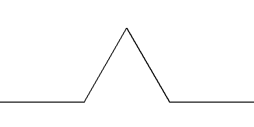
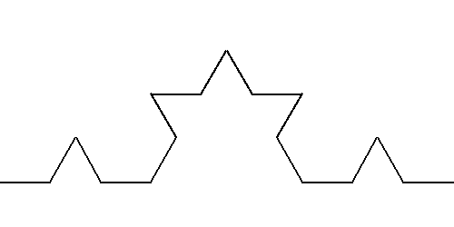
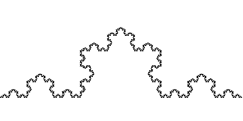

# Rekursive Grafiken

Schreibe ein Programm, das mit dem Parameter `n=1` eine Grundform aus vier Linien zeichnet:

Wenn Du `n` erhöhst, soll jede Linie durch eine kleinere Ausgabe der Grundform ersetzt werden. Mit `n=2` solltest Du beispielsweise erhalten:

Und mit `n=5`:

## Hinweise

* ohne **Rekursion** kommst Du nicht besonders weit
* verwende zum Zeichnen `turtle` oder `pillow`
* die *"Schneeflocke"* in der Grafik ist auch als *"Koch-Kurve"* bekannt

## Zusatzaufgabe

* verändere die Grundform, so dass statt der Schneeflocke ein Busch oder Baum entsteht.
