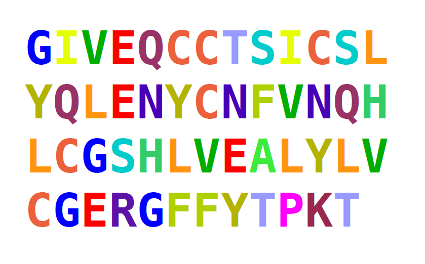

# Entscheidungen treffen

**Wie oft kommte der Buchstabe 'C' vor?**

Mit den bisherigen Python-Befehlen lassen sich bereits eine ganze Menge unterschiedliche Programme schreiben. Es fehlt uns allerdings noch eine wichtige Möglichkeit: Im Programm *Entscheidungen zu treffen*.

In Python gibt es für Entscheidungen (Verzweigungen) die `if`-Anweisung. Darum geht es in diesem Abschnitt.

### Aufgabe 1

Führe das folgende Programm aus und erkläre die Ausgabe:

    zahl = input("Bitte gib eine Zahl ein")

    if zahl > 10:
        print("Die Zahl ist größer als 10.")
    elif zahl == 10:
        print("Die Zahl ist genau 10.")
    else:
        print("Die Zahl ist kleiner als 10.")

### Aufgabe 2

Das folgende Programm soll die Positionen aller Buchstaben *"n"* im Namen ausgeben. Leider enthält das Programm **drei Fehler**. Bringe das Programm zum Laufen:

    name = "Anna"
    position = 1

    for buchstabe in name
        if buchstabe = "n":
            print(position)
    position = position + 1

### Aufgabe 3

Gegeben ist eine Liste der 20 beliebtesten Mädchennamen aus dem Jahr 2000:

    ['Emily', 'Hannah', 'Madison', 'Ashley', 'Sarah', 
    'Alexis', 'Samantha', 'Jessica', 'Elizabeth', 'Taylor', 
    'Lauren', 'Alyssa', 'Kayla', 'Abigail', 'Brianna', 
    'Olivia', 'Emma', 'Megan', 'Grace', 'Victoria']

Schreibe ein Programm, das alle Namen ausgibt, die mit einem `'A'` oder `'M'` anfangen.

### Aufgabe 4

Welche der folgenden `if`-Anweisungen sind syntaktisch korrekt?

* `if a and b:`
* `if len(s) == 23:`
* `if a but not b < 3:`
* `if a ** 2 >= 49:`
* `if a != 3`
* `if (a and b) or (c and d):`
