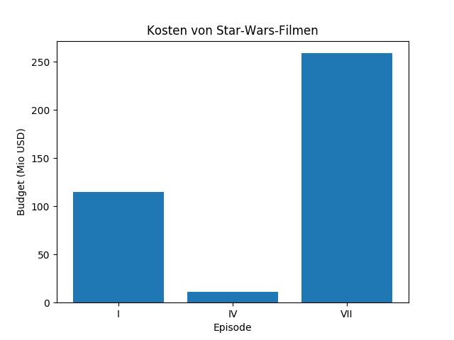

# Namen finden

## In diesem Kapitel lernst Du:

| Bereich | Thema |
|---------|-------|
| 💼 | Daten durchsuchen |
| 🔀 | Daten filtern |
| 🔀 | Daten-Records sammeln |
| ⚙ | Vergleichsoperatoren kombinieren |
| 💡 | Methoden von Listen |
| 💡 | Tabellarische Ausgabe |

----

In diesem Kapitel werden wir unsere Daten aus einer **Textdatei** einlesen und das für Strings gelernte darauf anwenden. Anschließend suchen wir nach Namen wie *'Miriam'* und *'Malcolm'*, die mit *'M'* beginnen und enden und sammeln diese in einer **Liste**.

Am Ende des Kapitels werden wir ein Balkendiagramm zeichnen.

## Textdateien einlesen

### Aufgabe 1

Erstelle in einem Texteditor eine Datei namens `bigbang.txt`. Fülle sie mit folgenden Daten:

    Emily,F,12562
    Amy,F,2178
    Penny,F,342
    Bernadette,F,129
    Leonard,M,384
    Howard,M,208
    Sheldon,M,164
    Stuart,M,82
    Raj,M,41

(Dies sind die gleichen Daten wie im vorigen Kapitel.)

### Aufgabe 2

Bringe das Programm zum Lesen der Datei zum Laufen, indem Du `close`, `line`, `"bigbang.txt"` und `print` in die Lücken einsetzt.

    f = open(___)
    for ____ in f:
        ____(line)
    f.____()

#### ACHTUNG:

Je nachdem was für einen Editor Du verwendest, mußt Du eventuell den kompletten Pfad (Verzeichnisnamen) zur Datei eingeben. Wenn Du Dich wunderst, daß das Programm *immer noch nicht* funktioniert, ist die wahrscheinlichste Ursache ein falscher Dateipfad oder Dateiname.

Ersetze unter Windows die **Backslashes durch normale Slashes (`/`)**

### Aufgabe 3

Erweitere das Programm so, dass es die Anzahl der Babys wie im letzten Kapitel aufsummiert.

## Aufgabe 4

Für die folgenden Übungen benötigst Du den offiziellen Babynamen-Datensatz von den US-Meldebehörden. Du kannst die Dateien von der Seite [http://www.ssa.gov/oact/babynames/limits.html](http://www.ssa.gov/oact/babynames/limits.html) herunterladen (es genügt die nicht nach Bundesstaaten aufgeschlüsselte Variante).

Entpacke die heruntergeladene Datei.

### Aufgabe 5

Schreibe ein Programm, das die Datei `yob2015.txt` einliest.
Berechne die Gesamtzahl der Babys für das Jahr 2015 berechnet und gebe sie aus. Vergleiche das Ergebnis mit dem für das Jahr 1915.

### Aufgabe 6

Schreibe ein Programm, das die Datei `yob2015.txt` einliest. Finde alle Zeilen, die Deinen Namen enthalten und gib diese auf dem Bildschirm aus.

----

## Methoden von Listen

Als nächstes werden wir einige Namen in einer Liste sammeln. Das ist eine gute Gelegenheit, diesen wichtigen Datentyp etwas näher kennen zu lernen.

### Aufgabe 7

Finde in IPython heraus, was die Ausdrücke mit der Liste in der Mitte anstellen.

### Aufgabe 8

Das folgende Programm sammelt Namen, die mindestens 10000x verwendet wurden, in einer Liste. Leider enthält das Programm **vier Fehler**. Finde und korrigiere diese.

    häufige = []

    for line in open('names/yob2015.txt'):
        spalten = line.strip().split(',')
        name = spalten[1]
        anzahl = int(spalten[3])
        if anzahl >= 10000
            häufige.append(name)

    print(haeufige)

### Aufgabe 9

Sammle Namen, die mit `'M'` anfangen und auf `'m'` enden in einer Liste. Gib die Liste sortiert aus.

## Balkendiagramm

### Aufgabe 10

Führe dieses Programm aus:

    from matplotlib import pyplot as plt

    plt.figure()

    x = range(3)
    y = [115, 11, 259]
    labels = ["I", "IV", "VII"]

    plt.xticks(x, labels)
    plt.bar(x, y)

    plt.title('Kosten von Star-Wars-Filmen')
    plt.xlabel('Episode')
    plt.ylabel('Budget (Mio USD)')

    plt.savefig('starwars.png')

### Aufgabe 11

Plotte die ersten fünf Namen, die mit *'M'* beginnen und enden in einem Balkendiagramm.

----

## Zusatzaufgaben

### Aufgabe 12

Schreibe ein Programm, welches den prozentualen Anteil der 10 häufigsten Namen für das Jahr 2015 berechnet und ausgibt.

### Aufgabe 13

Verwende die angegebenen Ausdrücke, um die Liste wie angegeben zu verändern. Verwende jeden Ausdruck genau einmal.

### Aufgabe 14

Verwende die angegebenen Ausdrücke, um die Liste wie angegeben zu verändern. Verwende jeden Ausdruck genau einmal.

## Texteditoren

Für einige der Aufgaben ist ein **Texteditor** sinnvoll.

* **Idle** - ein minimalistischer Editor für Python, der Teil der Standard-Distribution ist
* **Sublime Text 2** - ein sehr mächtiger Texteditor mit konfigurierbaren Sonderfunktionen.
* **PyCharm** - eine professionelle auf Python spezialisierte Entwicklungsumgebung, die zum Entwickeln großer Projekte sehr gut geeignet ist. Du wirst 90% der Funktionen eine lange Zeit lang nicht brauchen, aber es ist ein sehr schönes Programm.
* **Notepad++** - ein sehr nützlicher Editor für Windows. *Bitte verwende auf keinen Fall Notepad, um Python zu programmieren. Du tust Dir keinen Gefallen damit. Du solltest stattdessen lieber versuchen, mit einer Nagelfeile aus dem Gefängnis auszubrechen.*
* **vim** - ein konsolenbasierter Texteditor für Unix. Dies ist das Werkzeug der Wahl für Systemadministratoren und alle Entwickler, die sich oft auf anderen Rechnern einloggen müssen, um dort zu arbeiten.

## Records

* store other data structures
* challenge: store the names of your family members
* challenge: store your name, address, age

## semantic error
* reinitialize empty list
