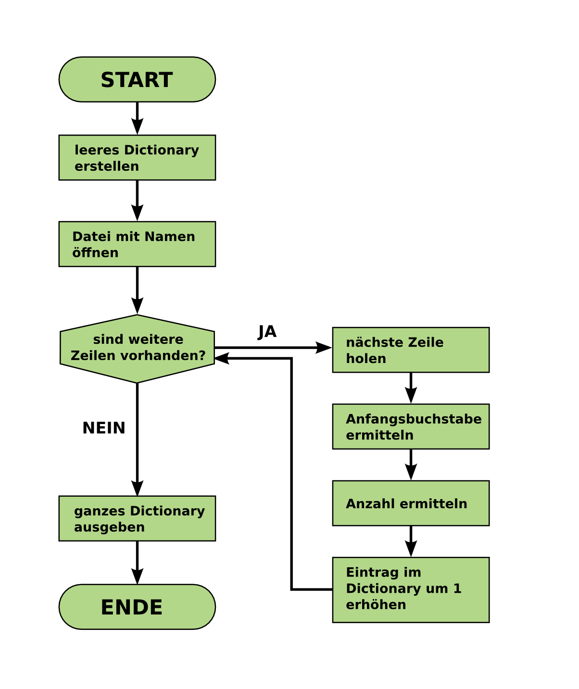

# Buchstaben zählen

In diesem Kapitel werden wir ein Programm schreiben, das **die häufigsten Anfangsbuchstaben** in Babynamen ermittelt. Dazu benötigen wir einen neuen, wichtigen Datentyp: **Dictionaries**

Dictionaries eignen sich gut zum Suchen und Nachschlagen.

### Aufgabe 1

**Suche englische Wörter, die mit Suchen zu tun haben.**

### Aufgabe 2

Finde heraus, was jeder der Ausdrücke mit dem Dictionary in der Mitte anstellt.

### Aufgabe 3

Dieses Flussdiagramm zeigt schematisch ein Programm zum Zählen von Anfangsbuchstaben:

Nimm an, das folgende Datei verarbeitet wird:

    Penny,F,342
    Leonard,M,384
    Sheldon,M,164
    Stuart,M,82

Beantworte folgende Fragen:

1. Was sollte nach Ausführen des Programms im Dictionary stehen?
2. Was wird ausgegeben, wenn die Datei stattdessen leer ist?
3. Durch einen Datenfehler enthält die Eingabedatei eine Leerzeile. An welcher Stelle des Flussdiagramms könnten dadurch Probleme entstehen?

### Aufgabe 4

Jetzt fangen wir an, das Programm zu *implementieren*.

Schreibe zuerst den Code für die **erste** und die **letzte** Box im Flussdiagramm.

Im leeren Dictionary kannst Du den Wert für alle Buchstaben auf `0` setzen:

    data = {
    	'A': 0,
    	'B': 0,
    	...
    }

Dies ist nicht die kürzeste Variante, aber am einfachsten zu verstehen.

Stelle sicher, dass das Programm läuft.

### Aufgabe 5

Baue als nächstes die Verarbeitung der Datei in das Programm ein. Schreibe dazu den Code für die restlichen Boxen im Flussdiagramm links, sowie die oberste Box rechts (*"nächste Zeile holen"*).

Dazu kannst Du eine `for`-Schleife aus einem früheren Programm *"ausleihen"*.

Stelle sicher, dass das Programm läuft.

### Aufgabe 6

Kümmere Dich nun um die Box *"Anfangsbuchstabe ermitteln"*.

Gib den in jeder Zeile ermittelten Anfangsbuchstaben aus.

Stelle sicher, dass das Programm läuft.

### Aufgabe 7

Kümmere Dich nun um die restlichen Boxen.

Um einen Wert in einem Dictionary zu erhöhen, kannst Du folgendes Muster verwenden:

    data[schluessel] = data[schluessel] + 1

oder kürzer:

    data[schluessel] += 1

Stelle sicher, dass das Programm läuft.

### Aufgabe 8

Vereinfache das Programm (das Erstellen des leeren Dictionaries), indem Du die Methode `d.setdefault()` verwendest.

### Aufgabe 9

Erstelle eine Liste mit den Schlüsseln des Dictionaries und eine zweite mit den entsprechenden Werten. Verwende das Muster:

    for key in dictionary:
        print(key, dictionary[key])

Alternativ kannst Du auch mit der Methode `d.items()` alle Schlüssel-Wert-Paare ermitteln.

### Aufgabe 10

Plotte die Häufigkeit der Buchstaben als Balkendiagramm.

### Aufgabe 11

Zähle die Anzahl der Babys anstatt für jeden Namen nur um 1 hochzuzählen (falls Du nicht schon längst selbst darauf gekommen bist).

### Aufgabe 12

Sammle die Buchstabenhäufigkeiten für **alle** Jahrgänge im Dictionary.

Das Dictionary enthält dann für jeden Buchstaben eine Liste, z.B.:

    data = {
        'A': [100, 103, 107, ..],
        'B': [73, 32, 22, ..],
        ..
    }

Normalisiere die Anahl, indem Du durch die Geburtenzahl teilst.

Plotte einige Liniendiagramme, um zu sehen, ob einige Buchstaben mit der Zeit häufiger werden.

## Quizfragen zu Dictionaries

### Aufgabe 13

Was haben folgende Anweisungen zum Ergebnis?

    d = {'cat':'Katze', 'dog':'Hund', 'fish':'Fisch'}
    print(d['fish'])

<quiz name="">
    <question>
        <answer><code>True</code></answer>
        <answer><code>fish</code></answer>
        <answer correct><code>Fisch</code></answer>
        <answer>eine Fehlermeldung</answer>
        <explanation></explanation>
    </question>
</quiz>

### Aufgabe 14

Was haben folgende Anweisungen zum Ergebnis?

    d = {'cat':'Katze', 'dog':'Hund', 'fish':'Fisch'}
    print('Hund' in d)

<quiz name="">
    <question>
        <answer><code>Hund</code></answer>
        <answer correct><code>False</code></answer>
        <answer><code>True</code></answer>
        <answer><code>dog</code></answer>
        <explanation></explanation>
    </question>
</quiz>

### Aufgabe 15

Was haben folgende Anweisungen zum Ergebnis?

    d = {'cat':'Katze', 'dog':'Hund', 'fish':'Fisch'}
    print(list(d.keys()))

<quiz name="">
    <question>
        <answer correct>Englische Begriffe, aber die Reihenfolge ist nicht vorhersagbar.</answer>
        <answer><code>['cat', 'dog', 'fish']</code></answer>
        <answer>Deutsche Begriffe, aber die Reihenfolge ist nicht vorhersagbar.</answer>
        <answer><code>['Katze', 'Hund', 'Fisch']</code></answer>
        <explanation></explanation>
    </question>
</quiz>

### Aufgabe 16

Was haben folgende Anweisungen zum Ergebnis?

    d = {'cat':'Katze', 'dog':'Hund', 'fish':'Fisch'}
    print(d.get('Katze', 'unknown'))

<quiz name="">
    <question>
        <answer><code>False</code></answer>
        <answer><code>'cat'</code></answer>
        <answer correct><code>'unknown'</code></answer>
        <answer><code>True</code></answer>
        <explanation></explanation>
    </question>
</quiz>

### Exercise 17

Was haben folgende Anweisungen zum Ergebnis?

    d = {'cat':'Katze', 'dog':'Hund', 'fish':'Fisch'}
    d.setdefault('cat', 'Stubentiger')
    print(d['cat'])

<quiz name="">
    <question>
        <answer>eine Fehlermeldung</answer>
        <answer><code>'Stubentiger'</code></answer>
        <answer><code>'cat'</code></answer>
        <answer correct><code>'Katze'</code></answer>
        <explanation></explanation>
    </question>
</quiz>

### Aufgabe 18

Bilde Paare von Datentypen und Werten.

