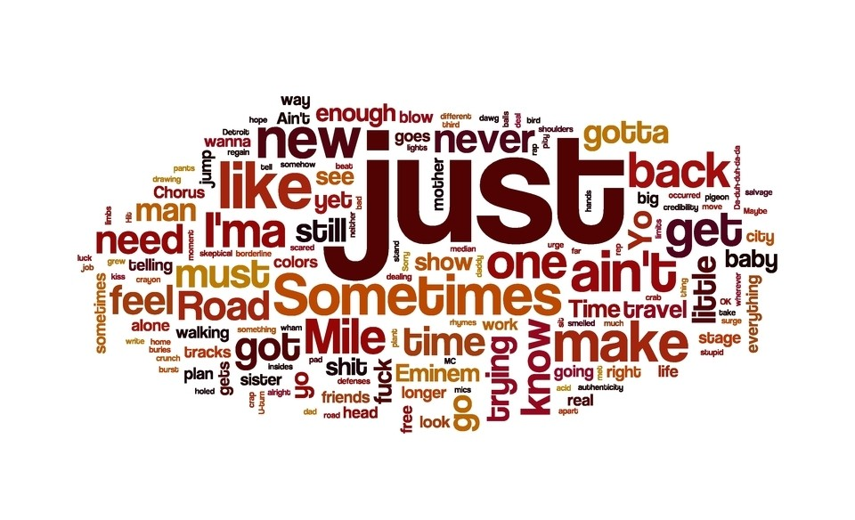

# Songtexte

*häufige Wörter in Songtexten von Eminem*

## Ziel

In diesem Kapitel werden wir **aus Songtexten die Interpreten vorhersagen**.

Unser Programm soll lernen, aus Sätzen wie

* *"we will dance and have a good time"*
* *"I want you to know, yeah, that I still love you so"*
* *"the little bags of dope, there was a pile of coke"*

einen möglichen Interpreten zu nennen.

Das Projekt besteht aus drei Teilen:

| Teil | Aufgabe      | Technologien |
|------|--------------|--------------|
|  1.  | Songs aus dem Internet herunterladen | web scraping, requests |
|  2.  | Texte aus HTML-Code extrahieren | Reguläre Ausdrücke |
|  3.  | Klassifikation von Texten | maschinelles Lernen, Naive Bayes |

## Links

[Are Pop Lyrics getting more repetitive?](https://pudding.cool/2017/05/song-repetition/index.html)

----

# Teil 1: Songliste herunterladen

## Aufgabe 1.1

Besuche im Browser die Seite [azlyrics.com](http://www.azlyrics.com). Suche Dir einen beliebigen Interpreten aus (außer **Madonna**, **Eminem** und **Beatles**, die habe ich schon).

Notiere Dir die URL.

## Aufgabe 1.2

Erstelle eine Python-Datei `download.py`.

## Aufgabe 1.3

Verwende das Modul `requests`, um die Seite mit der Songliste des gewählten Interpreten herunterzuladen.

Damit das funktioniert, müssen wir so tun als wäre Python ein Browser. Das geht mit:

    headers = {'User-Agent': 'Mozilla/5.0 (Macintosh; Intel Mac OS X 10_10_1)
    AppleWebKit/537.36 (KHTML, like Gecko) Chrome/39.0.2171.95 Safari/537.36'}
    seite = requests.get(url, headers=headers)

## Aufgabe 1.4

Speichere die heruntergeladene Seite in einer HTML-Datei.

#### Hinweis:

Wenn in der Seite bestimmte Sonderzeichen vorkommen, mußt Du die Datei zum Schreiben öffnen mit:

    f = open(dateiname, 'w', encoding='utf-8')

# Teil 2: Songs auslesen

## Aufgabe 2.1

Erstelle eine neue Python-Datei `songs_auslesen.py`.

## Aufgabe 2.2

Lies die in Aufgabe 1.4 gespeicherte HTML-Datei ein.

## Aufgabe 2.3

Betrachte die HTML-Datei in einem Texteditor. Finde heraus, wo in der Datei die Songtitel und Links in der Seite sind und woran das Programm diese Stellen erkennen kann.

## Aufgabe 2.4

Schreibe ein Programm, das alle Links zu songs aus der Seite ausliest und in einer Liste sammelt, z.B.:

    [
     'madonna/frozen.html',
     'madonna/burningup.html',
     ..
    ]

Mögliche Ansätze:

* `string.find`
* `string.split`
* Position im String (falls sie immer die gleiche ist)
* Reguläre Ausdrücke

#### Hinweis:

Wenn in der Seite bestimmte Sonderzeichen vorkommen, mußt Du die Datei öffnen mit:

    f = open(dateiname, 'r', encoding='utf-8')

## Aufgabe 2.5

Gib alle Links auf dem Bildschirm aus und prüfe nach, ob das Programm korrekt arbeitet.

## Aufgabe 2.6

Verpacke den bisher geschriebenen Code in eine Funktion:

    def titel_auslesen(dateiname):
        # Dein Code kommt hierhin
        return songtitel

Rufe die Funktion im Programm aus und stelle sicher, daß es immer noch funktioniert.

# Teil 3: Songtexte herunterladen

## Aufgabe 3.1

Erstelle Dir ein Verzeichnis, in dem Du die Songtexte speichern möchtest.

## Aufgabe 3.2

Lösche sämtliche Leer- und Sonderzeichen aus dem Songtitel, um einen Dateinamen zu erhalten.

Füge dem Dateinamen als Endung `.html` hinzu.

## Aufgabe 3.3

Nimm **nur den ersten Song der Liste**. Erstelle aus dem Link zu diesem Song eine vollständige URL.

## Aufgabe 3.4

Lade einen *einzelnen* Song herunter und speichere diesen in einer Textdatei.

## Aufgabe 3.5

Verpacke das Herunterladen eines Songs in einer Funktion:

    def song_herunterladen(titel, link):
        # Dein Code hierhin

Verwende wie in Aufgabe 1 die `headers`, um einen Browser zu simulieren.

## Aufgabe 3.6

Verwende das Modul `time`, um nach dem Herunterladen und Speichern eines Songs 120 Sekunden zu warten:

    import time
    time.sleep(120)

**DIES IST DER WICHTIGSTE SCHRITT IN DER HEUTIGEN AUFGABE. WENN EINER VON UNS DIESEN VERGISST, KANN ES GANZ LEICHT PASSIEREN, DASS DER SERVER DIE GANZE KLASSE AUSSPERRT.**

## Aufgabe 3.7

Verwende die Funktion `song_herunterladen`, um **die ersten 20 Songs** herunterzuladen.

## Aufgabe 3.8

Prüfe vor dem Herunterladen, ob eine Datei schon existiert:

    import os
    if os.path.exists()

Lade nur Dateien herunter, die es noch nicht gibt.
