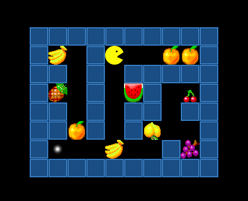

# Ein Mini-Spiel schreiben

Die Python-Bibliothek [`tilegamelib`](https://github.com/krother/tilegamelib) vereinfacht das Verwenden der beliebten Bibliothek **pygame**. Sie erleichtert das Erstellen einfacher Spiele mit Klötzchengrafik. In diesem Projekt schreiben wir ein einfaches Labyrinth-Spiel mit einigen Zeilen Python-Code.

Zunächst installiere die Bibliothek mit:

    pip install tilegamelib

## 1. Erstelle ein Spiel-Objekt

Die Grundlage für Spiele ist die Klasse `tilegamelib.Game`. Diese musst Du importieren:

    from tilegamelib import Game

Nun kannst Du ein `Game`-Objekt erstellen und dessen *Event-Schleife* ausführen:

    game = Game()
    game.event_loop()

Beim Ausführen des Programms solltest du ein schwarzes Fenster sehen, das beim Drücken der *Escape*-Taste verschwindet. Bei einigen Entwicklungsumgebungen (darunter Anaconda Spyder) kann das Fenster im Hintergrund erscheinen. Suche es mit `Alt+Tab`.

## 2. Eine Spiel-Klasse

Schreibe Dir als nächstes eine Klasse für das Spiel, die sämtliche Daten für das Spiel enthält. Wir erstellen das `Game`-Objekt in dieser Klasse. Achte darauf, dass Du durch Voranstellen von `self` ein **Attribut** des Objekts daraus machst. Damit ist `self.game` in allen Funktionen dieser Klasse verfügbar.

    class MazeGame:

        def __init__(self):
            self.game = Game()
            self.game.event_loop()

Nun musst Du eine *Instanz* der Klasse `MazeGame` bilden. Es ist üblich, dazu einen `__main__`-Abschnitt am Ende der Datei zu verwenden:

    if __name__ == '__main__':
        maze_game = MazeGame()

## 3. Zeichnen einer Karte

Die Klasse `tilegamelib.TiledMap` kümmert sich um das Zeichnen von 2D-Karten, die aus quadratischen Kacheln bestehen. Importiere diese:

    from tilegamelib import TiledMap

Erstelle in der Funktion `__init__` eine neue Karte und füllen sie mit Wänden (`'#'`) auf:

    self.map = TiledMap(self.game)
    self.map.fill_map('#', (10, 10))

Noch siehst Du nichts. Zuerst benötigst Du eine neue Methode in `MazeGame`, die sich um das Zeichnen der Karte kümmert:

    def draw(self):
        self.map.draw()

Du mußt außerdem den Aufruf von `event_loop()` so verändern, dass unsere `draw()`-Methode in regelmäßigen Abständen aufgerufen wird. Achte darauf, dass **`event_loop()` als letztes in der Methode `__init__()` aufgerufen wird.**

    self.game.event_loop(draw_func=self.draw)

Nun solltest Du eine Art blaues Gitter sehen.

## 4. Inhalt der Karte

Damit auf dem Bildschirm etwas mehr los ist, setzen wir den Inhalt der Karte auf einen String mit 10 Zeilen von jeweils 10 Zeichen:

    MAZE = """##########
    #........#
    #.#.####.#
    #.#......#
    #.#....#.#
    #.#....#.#
    #......#.#
    #.####.#.#
    #........#
    ##########"""

Diesen String schicken wir an das `TiledMap`-Objekt:

    self.map.set_map(MAZE)

Es gibt mehrere vordefinierte Grafikelemente:

| Zeichen    | Beschreibung |
|------------|--------------|
| `#`        | Wand     |
| `.`        | leer     |
| `*`        | Punkt      |
| `x`        | dunkle Kiste  |
| `X`        | helle Kiste  |
| `a`-`h`    | Früchte     |
| `d`        | Diamant   |
| `+`        | Stern     |
| `@`        | blauer Punkt  |

## 5. Sprites

Du kannst **Sprites**, bewegliche Objekte definieren:

    from tilegamelib.sprites import Sprite

Ein Sprite muss ebenfalls in `__init__` erstellt werden (wieder **vor** dem Aufruf von `event_loop`). Unserem Sprite hier geben wir ein bekanntes *"Gesicht"*:

    self.sprite = Sprite(self.game, 'b.pac_right', (1, 1), speed=2)

In `draw()` zeichnen wir den Sprite:

    self.sprite.draw()

## 6. Action!

Nun soll sich der Sprite bewegen. Die Klasse `Game` kümmert sich um das Abfragen der Tastatur. Wir müssen nur noch die Pfeiltasten auf unsere eigene Bewegungs-Methode umleiten. Da dies in vielen Spielen nötig ist, ist dazu in `tilegamelib` schon etwas vorgesehen. Schreibe:

    def move(self, direction):
        print(direction)

Und modifiziere den Aufruf von `event_loop()`:

    self.game.event_loop(figure_moves=self.move, draw_func=self.draw)

Nun solltest Du sehen, dass `direction` einen anderen Vektor für jede Pfeiltaste enthält. Wir können diesen Vektor an `sprite` übergeben, so dass dieser sich bewegt:

    self.sprite.add_move(direction)

Um die Bewegung auszuführen, müssen wir `self.sprite.move()` in regelmäßigen Abständen aufrufen. Füge zur Methode `draw()` folgenden Befehl hinzu:

    self.sprite.move()

Nun sollte sich die Figur durch das Labyrinth bewegen!

## 7. Fragen

### 7.1 Wie kann ich prüfen, welche Kachel an der Position der Figur liegt?

    print(self.map.at(self.sprite.pos))

### 7.2 Wie kann ich prüfen, an welche Position sich der Sprite bewegt?

    print(self.sprite.pos + direction)

### 7.3 Wie kann ich etwas auf der Karte platzieren?

    self.map.set_tile((4,4), 'a')

### 7.4 Was für Kacheln gibt es noch?

Siehe in der Datei [`tiles.conf`](https://github.com/krother/tilegamelib/blob/master/examples/data/tiles.conf) nach.

### 7.5 Kann ich Text schreiben?

    self.game.frame.print_text("Hello World", (50, 400))

### 7.6 Ich möchte einen Geist programmieren, der sich zufällig bewegt. Wie?

Du findest alle wichtigen Vektoren mit:

    from tilegamelib.vector import UP, DOWN, LEFT, RIGHT

Platziere den Code zum Bewegen eines Geistes zu Beginn von `draw()`.

## 8. Schreibe ein Spiel!

Die Dokumentation von `tilegamelib` ist noch recht dürftig. Insbesondere, wie Du eigene Grafiken, Tasten und Soundeffekte hinzufügen kannst. Bitte berichte Fragen und mögliche Fehler auf [GitHub](https://github.com/krother/tilegamelib) oder per E-Mail an `krother@academis.eu`.
